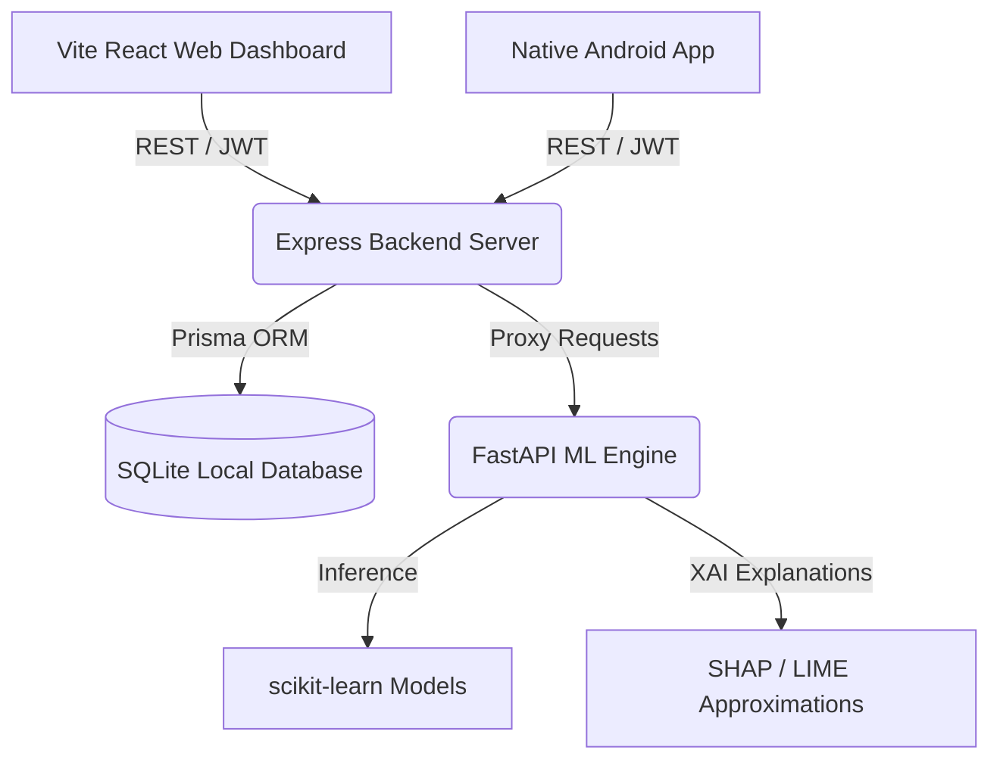

# CipherEye – AI Powered Cybercrime & Scam Detection Assistant

CipherEye is a fully functional, enterprise-grade cyber security platform designed to detect phishing, scams, and deepfakes. It uses Machine Learning models, lexical parsing heuristics, and Natural Language Processing to analyze URLs, SMS text logs, QR codes, and media assets.

The repository includes:
1. **Node.js Express TypeScript Backend Server** (Database: Prisma + SQLite, Auth: JWT, OTP verification, Audit logs)
2. **Python FastAPI Machine Learning Microservice** (Classifiers: Scikit-Learn URL phishing and text spam classifiers, XAI explainability metrics)
3. **Vite React TypeScript Web Console** (A premium responsive glassmorphic dark-mode dashboard)
4. **Android Native Mobile Application** (Built using modern Kotlin and Jetpack Compose)

---

## System Architecture



---

## Port Configurations

| Service | Port | Endpoint | Description |
| :--- | :--- | :--- | :--- |
| **ML Engine** | `8000` | `http://localhost:8000` | FastAPI ML/NLP Inference Server |
| **Backend API** | `5001` | `http://localhost:5001` | Express controller & DB transaction API |
| **Web Console** | `3000` | `http://localhost:3000` | Vite React Web Dashboard |

---

## Getting Started

### 1. Machine Learning Engine (FastAPI)
The FastAPI service handles direct inference using real trained model parameters (logistic regression and Naive Bayes) generated by `train.py`.

```bash
cd ml-service
pip3 install -r requirements.txt
python3 train.py
python3 -m uvicorn app:app --host 0.0.0.0 --port 8000
```

### 2. Backend Server (Express + TS)
Handles user sessions, authentication, support ticketing, audit logging, and coordinates scan submissions to the ML engine.

```bash
cd backend
npm install
npx prisma db push
npm run dev
```

### 3. Web Dashboard (Vite + React)
A high-fidelity dashboard console with charts, scan uploads, and administrative audit panels.

```bash
cd web
npm install
npm run dev
```

### 4. Native Android App & APK Build
The mobile app compiles into a shareable Android APK:

```bash
cd mobile
export JAVA_HOME="/opt/homebrew/opt/openjdk@17/libexec/openjdk.jdk/Contents/Home"
./gradlew assembleDebug
```
The compiled shareable `.apk` file is located at:
`mobile/app/build/outputs/apk/debug/app-debug.apk`

---

## Verification & Testing

* **Backend Tests**: Run `npm run test` inside the `/backend` folder. Verified passing using mock integrations.
* **HTML/CSS Validations**: Checked against Vite production compilations.
* **Automation Ready**: Every view item contains deterministic `data-testid` (web) and `testID` (Android) properties.
